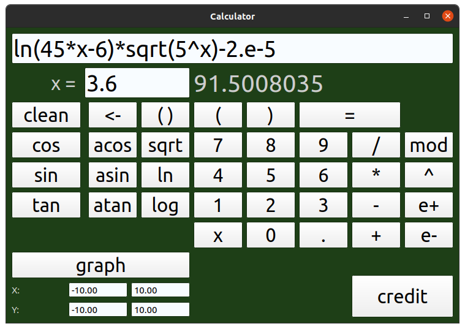

# Smart Calculation

## Content

A calculator with a graphical interface is implemented in this project. It supports standard mathematical operations, the calculation of some elementary functions, the construction of graphs of functions, the calculation of the value of a function at a specific point. There is also an additional tab for calculating credits.

For calculations, the calculator uses the reverse Polish notation algorithm, the graphics are written in Qt.

To build, you need: `QT 5.15.2` and above.
The program is built with Makefile with targets: all, install, uninstall, clean, dvi, dist, tests; Makefile runs on MacOS.

## Main part

The main page contains numbers, operations, functions, constants, special characters and 'x'.

The numbers `0-9` are responsible for entering the corresponding number.
The following functions are supported: cos(x), sin(x), tan(x), acos(x), asin(x), atan(x), sqrt(x), ln(x), log(x), exponential notation for numbers.
You can enter using the buttons or through the keyboard.

Correct input is required, namely:

 1) The number of opening and closing brackets is the same. `(2+3)*2` - correct notation, `((2+3)*2` - incorrect notation.
 2) The arguments of all functions are indicated in brackets. `sin(x)` is valid, `sinx` is invalid.
 3) There are no unintended literals in the expression record.

If you enter an incorrect entry, an inscription about this appears in the answer field.

## Plotting a graph of a function

In addition to calculating standard mathematical expressions, this calculator supports plotting functions and calculating the value of a function at a certain point.

You can plot a graph or calculate the value of a function if you have `x` in the input string.

 1) When calculating a value at a function point, you will be prompted to enter it, a value will be substituted in place of `x` and the calculation will be performed.
 2) When plotting a function, you will be prompted to specify the domain of the function and the range of values. In the future, the resulting graph can be scaled and moved.

## Credit calculator

Additionally, the implementation of a loan calculator is presented, similar to most online loan calculators.

Input data:

  1) `Summa` - loan amount, in any currency.
  2) `Months` - loan term - numerically.
  4) `Percents` - percentage per annum on the loan.
  5) Type of payments: authentic or differential.

Output:

  1) `First payment` - monthly loan payments
  2) `More` - overpayment on the loan.
  3) `Total` - the total payment on the loan.

After entering the data, you must click on the `calculate` button - then the calculations will be made.

