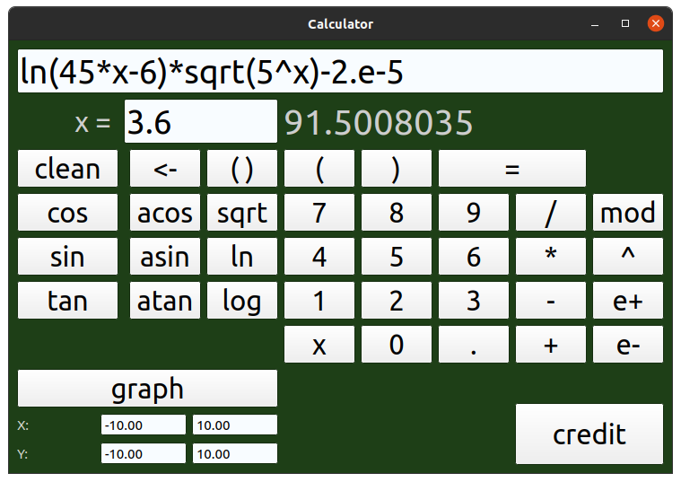
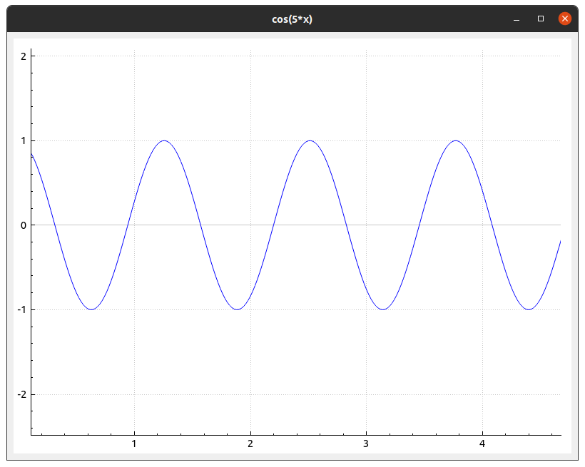
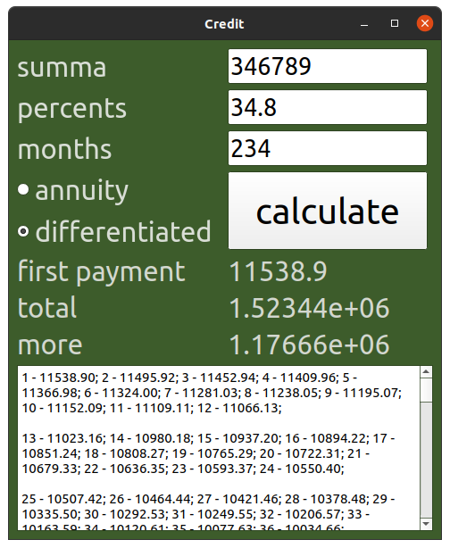

# Smart Calculation

## Содержание

В данном проекте реализован калькулятор с графическим интерфейсом. Он поддерживает как стандартные математические операции, так и вычисление некоторых элементарных функций, построение графиков функций, вычисление значения функции в конкретной точке. Также есть дополнительная вкладка для вычисления кредитов. 

Для вычислений в калькуляторе используется алгоритм обратной польской нотации, графика написана на Qt.

Для сборки нужны: `QT 5.15.2` и выше.
Сборка программы настроена с помощью Makefile с набором целей all, install, uninstall, clean, dvi, dist, tests; Makefile запускается в MacOS.

## Основной калькулятор

На основной странице располагаются числа, операции, функции, константы, специальные символы и 'x'.

Числа `0-9` отвечают за ввод соответствующего числа.
оддерживается ввод следующих функций:cos(x), sin(x), tan(x), acos(x), asin(x), atan(x), sqrt(x), ln(x), log(x), экспоненциальной форма записи чисел.
Вводить можно кнопками либо через клавиатуру.

Необходима корректность ввода, а именно:

 1) Количество открывающих и закрывающих скобок - совпадает. `(2+3)*2` - корректная запись, `((2+3)*2` - некорректная запись. 
 2) Аргументы всех функций обозначены в скобках. `sin(x)` - корректная запись, `sinx` - некорректная.
 3) В записи выражения отсутсвуют непредусмотренные литералы.

При неправильном вводе в поле ответа появляется надпись об этом.

## Графики функции и значения в точке

Помимо вычисления стандартных математических выражений, данный калькулятор поддерживает построение графиков функций и вычисление значения функции в определенной точке. 

Построить график или вычислить значение функции можно при наличии `x` во входной строке.

 1) При вычислении значения в точке функции будет предложенно ввести её, на место `x` будет подставлено значение и произведено вычисление. 
 2) При построении графика функции будет предложено указать область определения функции и область значений. В дальнейшем полученный график можно масштабировать и передвигать.

## Кредитный калькулятор 

Допольнительно представлена реализация кредитного калькулятора, по аналогии с большинством онлайн кредитных калькуляторов.

Входные данные:

 1) `Summa` - сумма кредита, в любой валюте.
 2) `Months` - срок кредита - численно.
 4) `Percents` - процент годовых по кредиту.
 5) Тип выплат: аутиентные или диффериентные.

Выходные данные:

 1) `First payment` - месячные выплаты по кредиту 
 2) `More` - переплата по кредиту.
 3) `Total` - общая выплата по кредиту.

После введения данных необходимо нажать на кнопку `calculate` - тогда и будут произведены расчёты.

